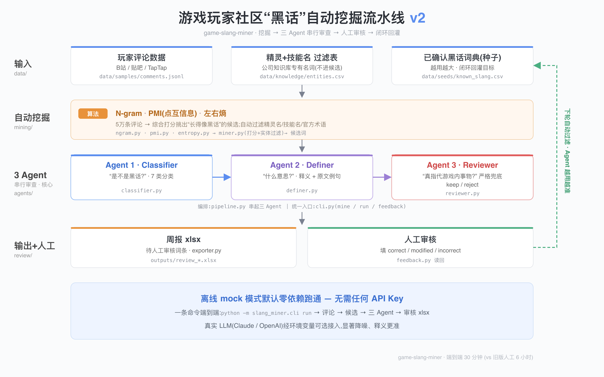
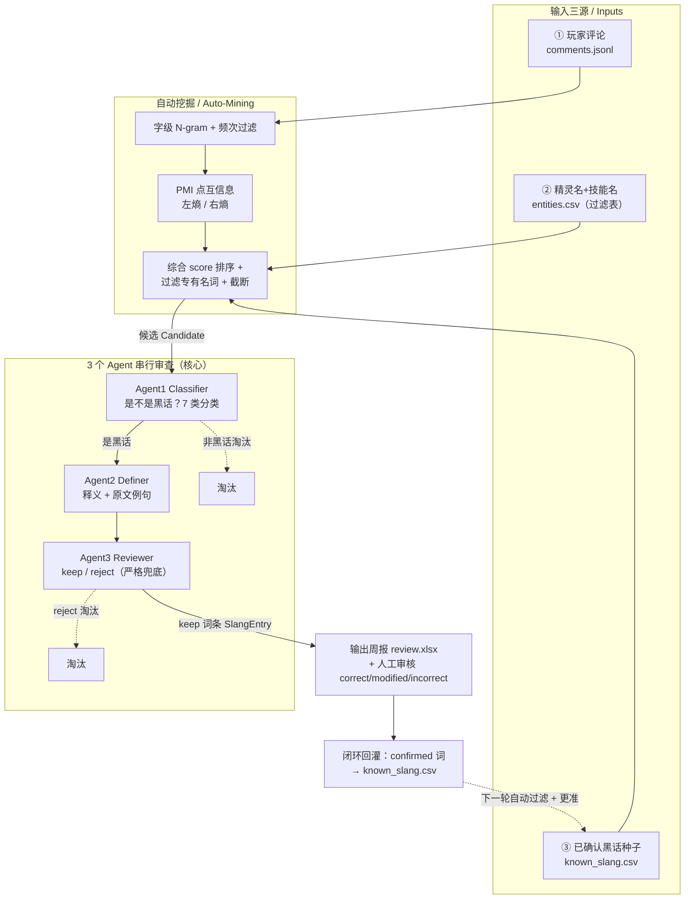
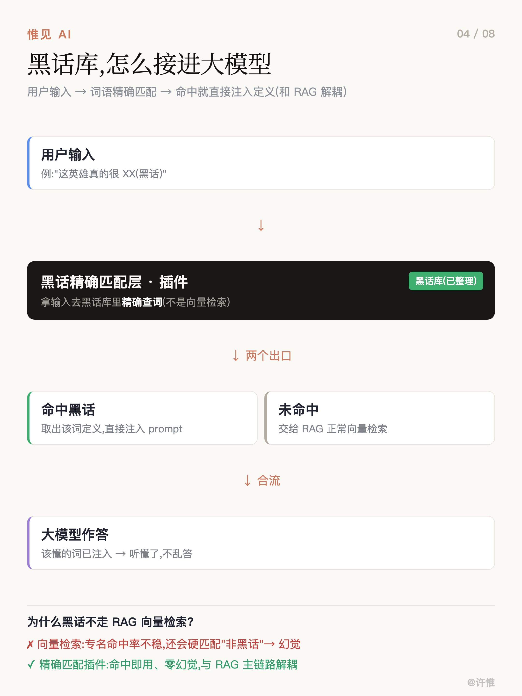

<div align="center">

# 🎮 game-slang-miner
### 游戏玩家社区「黑话」自动挖掘流水线 v2

**从海量玩家评论里，自动挖出官方词典查不到的「黑话」——并且越用越准。**

_Mine community slang from player comments → 3-agent serial review → human-review workbook → self-improving feedback loop._

[](../../actions)

-brightgreen)


<br/>



</div>

---

## ✨ 30 秒看懂 · TL;DR

- **它解决什么**：游戏运营每天读不完的玩家评论里全是 `御三家`、`奶妈`、`非酋`、`打本` 这类查无此词的黑话，人工整理慢且易漏。
- **它怎么做**：`N-gram + PMI + 左右熵` 自动挖候选 → **3 个 Agent 串行审查**（分类→释义→兜底）→ 导出周报 `xlsx` 给人工只做「判对错」→ 确认词回灌词典，**下一轮更准**。
- **为什么能直接跑**：**默认离线 mock 模式，零 API Key、一条命令端到端跑通**；想要更准再一键切真实 LLM。

```bash
pip install -e . && slang-miner run     # 就这一行，立刻看到 outputs/ 里的审核周报
```

---

## 适用场景 · Who It's For

- **游戏运营 / 社区 / 内容团队**：自动追踪玩家黑话、梗、缩写，沉淀成可用、可维护的术语词典。
- **不止游戏**：任何「社区在持续造新词」的场景——电商行业黑话、垂直圈层术语、品牌口碑热词——都能复用同一套「统计挖掘 → Agent 审查 → 人工闭环」。把数据源和过滤表一换即可迁移。

> **设计理念**：统计方法负责**召回**（高频新词不漏、可复现），Agent 负责**理解**（分类 + 释义 + 兜底），人工只做**终判**（点对错）。每一次终判都回灌词典——**机器扛量、人扛准、系统越用越聪明**。

---

## 流水线全景图 · Pipeline at a Glance

> 完整架构见 **顶部大图**;以下提供可复制 / diff 的「ASCII 文本版」与 GitHub 可直接渲染的「Mermaid 版」。

<details>
<summary>📃 ASCII 文本版</summary>

```text
┌──────────────────────────── 输入三源 / 3 Inputs ────────────────────────────┐
│  ① 玩家评论  comments.jsonl   (B站 / 贴吧 / TapTap)                          │
│  ② 精灵名+技能名  entities.csv (公司知识库专有名词 → 过滤表)                 │
│  ③ 已确认黑话种子  known_slang.csv (上一轮回灌的结果)                        │
└───────────────┬─────────────────────────────────────────────────────────────┘
                │
                ▼
┌──────────────────────────── 自动挖掘 / Auto-Mining ─────────────────────────┐
│  字级 N-gram 枚举  →  频次过滤                                               │
│        │                                                                     │
│        ├─ PMI 点互信息   (内部凝固度：各部分是否真的爱黏在一起)              │
│        ├─ 左熵 / 右熵    (边界自由度：左右能不能接多种字)                    │
│        └─ 综合 score 排序                                                    │
│  →  过滤精灵名/技能名/官方术语(②)  →  截断 max_candidates                    │
│  →  候选 Candidate{ term, freq, pmi, left/right_entropy, score, examples }   │
└───────────────┬─────────────────────────────────────────────────────────────┘
                │  候选 N 个
                ▼
┌─────────────── 3 个 Agent 串行审查 / 3-Agent Serial Review ─────────────────┐
│                                                                              │
│   Agent1 Classifier   ── 是不是黑话？归入 7 类 ──┐  非黑话直接淘汰(短路)     │
│                                                  ▼                           │
│   Agent2 Definer      ── 什么意思？释义 + 原文例句 ──┐                       │
│                                                      ▼                       │
│   Agent3 Reviewer     ── 是否真指代游戏内事物？ keep / reject (严格兜底)     │
│                                                  reject 直接淘汰             │
└───────────────┬─────────────────────────────────────────────────────────────┘
                │  keep 的词条 SlangEntry(status="pending")
                ▼
┌──────────────────────── 输出 + 人工审核 / Review ───────────────────────────┐
│  导出周报 review_<时间戳>.xlsx                                              │
│  运营逐条在下拉填： correct / modified / incorrect                          │
└───────────────┬─────────────────────────────────────────────────────────────┘
                │  人工填好的 xlsx
                ▼
┌──────────────────────── 闭环回灌 / Feedback Loop ───────────────────────────┐
│  correct / modified 的词  →  回灌「已确认黑话词典」 known_slang.csv (③)      │
│  下一轮挖掘自动过滤这些词 + Agent 拿到更多种子  →  越用越准  ───┐            │
└────────────────────────────────────────────────────────────────┘            │
        ▲                                                                       │
        └───────────────────────────────────────────────────────────────────────┘
                                （闭环 / closed loop）
```
</details>

<details>
<summary>🔁 Mermaid 版本（GitHub 可直接渲染）</summary>


</details>

---

## 效率对比 · End-to-End vs. Manual

| 维度 | 纯人工整理 | 本流水线（端到端 + 人工只做审核） |
| --- | --- | --- |
| 候选发现 | 逐条读评论、凭记忆挑词，易漏 | 统计指标自动挖掘，高频新词无遗漏、可复现 |
| 专有名词过滤 | 人工记住所有精灵/技能名 | `entities.csv` 自动过滤，含子串碎片 |
| 分类 + 释义 | 逐词查证、手写释义 | 3 Agent 串行自动产出初稿，运营只做「判对错」 |
| 质量兜底 | 全靠人盯 | Reviewer 严格闸门，宁可错杀不放过 |
| 人工动作 | 从 0 整理 | **只在 xlsx 下拉里点 correct/modified/incorrect** |
| 越用越准 | 经验在个人脑子里 | 确认词自动回灌，下一轮过滤 + Agent 越来越准 |

> 一句话：**机器把「读评论 → 挖词 → 分类 → 释义 → 兜底」全包了，人只做最后一步「判定」**，
> 并且每一次判定都沉淀进词典，形成正反馈。

---

## 安装 · Installation

需要 Python **3.9+**。

```bash
git clone https://github.com/Mindse-Tt/game-slang-miner.git
cd game-slang-miner

python -m pip install --upgrade pip
pip install -r requirements.txt
pip install -e .          # 装上控制台脚本 slang-miner（src 布局）
```

运行时依赖只有三个轻量包：`jieba`（中文切分辅助）、`openpyxl`（xlsx 读写）、`pyyaml`（读配置）。
真实 LLM provider 为**可选**依赖，离线 mock 模式不需要安装。

---

## 快速开始 · Quick Start（离线 mock，一条命令端到端）

仓库自带样例数据（60 条评论 / 44 条过滤词 / 34 条种子），开箱即跑，**无需任何 API key**：

```bash
slang-miner run
```

预期输出（节选）：

```text
[流水线] 端到端流水线启动
[流水线]   LLM 模式：provider=mock offline=True
[流水线] 第 1 步｜读取评论
[流水线]   评论数：60
[流水线] 第 2 步｜自动挖掘 + 第 3 步｜Agent1 分类 → Agent2 释义 → Agent3 终审
[流水线]   终审通过（待人工审核）词条数：17
[流水线] 第 4 步｜导出周报 xlsx（供人工填写 correct/modified/incorrect）
[流水线] 完成｜review 周报已写入：.../outputs/review_<时间戳>.xlsx
```

三个子命令（对应流程图三段）：

```bash
# 只做自动挖掘，把候选存成 json（便于调参 / 复核挖掘质量）
slang-miner mine

# 端到端：挖掘 → 3 Agent 串行 → 导出 review 周报 xlsx
slang-miner run

# 闭环回灌：把人工填好的 xlsx 中 correct/modified 的词回灌种子词典
slang-miner feedback outputs/review_<时间戳>.xlsx
```

也可作为库直接调用：

```python
from slang_miner import run_pipeline, export_review_xlsx, Comment

comments = [Comment(id="1", source="bilibili", text="打本必带奶妈，非酋本酋")]
cfg = {"mining": {"min_freq": 1, "min_pmi": 0.0, "min_entropy": 0.0},
       "llm": {"provider": "mock", "offline": True}, "paths": {}}

entries = run_pipeline(comments, cfg)        # 含挖掘 + 3 Agent 串行
export_review_xlsx(entries, "review.xlsx")   # 导出人工审核周报
```

---

## 🧠 md 定义的 Agent Team · Agents as Editable Markdown

这套流水线的核心是一个 **3-agent 串行审查团队**,而且**每个 agent 的判断标准就是一份可编辑的 markdown**:

| Agent | 角色卡(判断标准) | 职责 |
|---|---|---|
| Classifier | [`agents/classifier.md`](agents/classifier.md) | 是不是黑话?7 类分类 |
| Definer | [`agents/definer.md`](agents/definer.md) | 什么意思?释义 + 原文例句 |
| Reviewer | [`agents/reviewer.md`](agents/reviewer.md) | 真指代游戏内事物吗?keep / reject 兜底 |

- **代码从这些 md 读取 system prompt**(`agents/base.py` 的 `load_prompt` + `_system_prompt`),类内硬编码 prompt 仅作离线 fallback。
- **人工校准 = 直接编辑 md**:每份角色卡都有「校准区」,人审确认 / 否决的正反例往里加,下一轮 agent 判得更准 —— *机器管召回,人管标准*。
- **在 Claude Code 里直接跑整个 team**:仓库带了 [`.claude/agents/`](.claude/agents) 三个子代理(slang-classifier / definer / reviewer),用真实模型跑,**无需 API key**。

> agent 不是焊死在代码里的黑盒,而是一份你能读、能改、能版本管理的 md 角色卡。

### 怎么接进你的 RAG · Plug into your RAG
整理好的黑话库,用**词语精确匹配**接入(命中即注入定义),与 RAG 向量检索**解耦** —— 避免向量检索对专名命中率不稳、对非黑话硬匹配produce 幻觉。



## 作为 Claude Code Skill 使用 · Use as a Claude Code Skill

仓库内置了一个 Claude Code 技能(`skill/game-slang-miner/SKILL.md`)。装上后,在 Claude Code 里直接说
「**帮我挖这些评论里的黑话**」「**整理一份玩家黑话词表**」即可自动触发整条链路,无需记命令。

```bash
# 安装为常驻 skill
cp -r skill/game-slang-miner ~/.claude/skills/game-slang-miner
```

技能会自动:准备输入三源 → `slang-miner run` 端到端 → 读回 `outputs/` 的审核周报并汇报结果 → 需要时闭环回灌。

---

## 配置说明 · Configuration

默认读取 `config/config.yaml`，可用 `slang-miner --config <path> <command>` 覆盖。

```yaml
mining:                 # 自动挖掘参数（N-gram + PMI + 左右熵）
  ngram_min: 2          # 最短 n-gram（字数）
  ngram_max: 4          # 最长 n-gram（字数）
  min_freq: 3           # 候选最低频次（低频统计不可靠）
  min_pmi: 1.0          # 候选最低 PMI（内部凝固度阈值）
  min_entropy: 1.0      # 左右熵较小值的阈值（边界自由度）
  max_candidates: 3000  # 输出候选上限

llm:                    # LLM 配置
  provider: "mock"      # mock | anthropic | openai
  model: ""             # 真实模型名（provider != mock 时填，留空用默认）
  offline: true         # true=强制离线 mock；false=走真实 API

paths:                  # 输入 / 输出（相对路径相对仓库根，运行时解析为绝对路径）
  comments: "data/samples/comments.jsonl"
  entities: "data/knowledge/entities.csv"
  seeds:    "data/seeds/known_slang.csv"
  out_dir:  "outputs"
```

数据文件格式：

- `comments.jsonl`：每行一个 JSON `{"id","source","text","ts"}`；
- `entities.csv`：`term,type`（精灵 / 技能 / 官方术语过滤表）；
- `known_slang.csv`：`term,definition,category`（已确认黑话种子，也是回灌目标）。

---

## 真实 LLM 接入 · Using a Real LLM

默认离线 mock 用本地启发式规则保证可跑通；要换成真实模型，只需改配置 + 设环境变量：

```yaml
llm:
  provider: "anthropic"   # 或 "openai"
  model: ""               # 留空则用默认：anthropic→claude-opus-4-8，openai→gpt-4o
  offline: false
```

```bash
# 二选一
export ANTHROPIC_API_KEY="sk-ant-..."     # provider: anthropic
export OPENAI_API_KEY="sk-..."            # provider: openai

pip install -e ".[anthropic]"   # 或 .[openai]，按需安装 SDK
slang-miner run
```

**降级保护**：若 `offline: false` 但缺少对应 API key，或真实调用抛错，
客户端会**自动降级为 mock 并打印告警**，绝不会让整条流水线中断。

---

## 目录结构 · Project Layout

```text
game-slang-miner/
├── README.md
├── LICENSE                        # MIT
├── pyproject.toml                 # 打包 / 控制台脚本 / pytest 配置（src 布局）
├── requirements.txt
├── config/config.yaml             # 全局配置
├── docs/architecture.{svg,png}    # 架构图（README 顶部大图）
├── docs/usage-plugin.png          # 使用机制图（接入 RAG）
├── docs/mining-pipeline.png       # 挖掘流水线竖版图
├── agents/                        # ★ 3 个 agent 的 md 角色卡（判断标准，可编辑 + 校准区）
├── .claude/agents/                # ★ Claude Code 子代理版（可直接跑整个 team）
├── skill/game-slang-miner/        # Claude Code 技能（SKILL.md）
├── data/
│   ├── samples/comments.jsonl     # 样例玩家评论
│   ├── knowledge/entities.csv     # 精灵名/技能名/官方术语 过滤表
│   └── seeds/known_slang.csv      # 已确认黑话种子（也是回灌目标）
├── src/slang_miner/
│   ├── __init__.py                # 公共 API 导出
│   ├── schema.py                  # 数据契约（唯一真相源）
│   ├── mining/                    # 自动挖掘
│   │   ├── ngram.py               #   字级 N-gram 抽取
│   │   ├── pmi.py                 #   点互信息（内部凝固度）
│   │   ├── entropy.py             #   左右邻接熵（边界自由度）
│   │   └── miner.py               #   编排：mine(comments, entities, config)
│   ├── agents/                    # 3 个串行 Agent（核心）
│   │   ├── base.py                #   LLMClient / BaseAgent / parse_json
│   │   ├── classifier.py          #   Agent1 ClassifierAgent
│   │   ├── definer.py             #   Agent2 DefinerAgent
│   │   └── reviewer.py            #   Agent3 ReviewerAgent
│   ├── pipeline.py                # 端到端编排 run_pipeline / run_agents
│   ├── review/exporter.py         # 周报 xlsx 导出 / 回读
│   ├── feedback.py                # 闭环回灌 ingest_reviewed
│   └── cli.py                     # 命令行入口（mine / run / feedback）
├── tests/test_smoke.py            # 离线端到端冒烟测试
└── .github/workflows/ci.yml       # CI：pip install + pytest
```

### 核心数据契约 · Core Contracts（`schema.py`）

| 类型 | 说明 |
| --- | --- |
| `SlangCategory` | 7 类枚举：角色称呼 / 玩法术语 / 装备道具 / 操作技巧 / 数值机制 / 社区梗缩写 / 其他 |
| `Comment` | 输入评论 `{id, source, text, ts}` |
| `Candidate` | 挖掘候选 `{term, freq, pmi, left_entropy, right_entropy, score, examples}` |
| `ClassifierResult` | Agent1 输出 `{term, is_slang, category, confidence}` |
| `DefinerResult` | Agent2 输出 `{term, definition, example}` |
| `ReviewerResult` | Agent3 输出 `{term, refers_in_game_entity, verdict(keep/reject), reason}` |
| `SlangEntry` | 最终词条 `{term, category, definition, example, confidence, sources, status}` |

---

## 测试 · Testing

```bash
pytest -v                                  # src 布局已在 pyproject 配好 pythonpath
pytest --cov=src --cov-report=term-missing # 覆盖率
```

`tests/test_smoke.py` 在离线 mock 下端到端验证：挖掘产出候选并过滤专有名词、
三 Agent 串行产出合法词条、xlsx 导出 + 回读、闭环回灌只收 correct/modified。

---

## 路线图 · Roadmap

- [ ] 挖掘：把 `score` 权重与停用词表外移到 config，支持按游戏调参。
- [ ] Agent：支持 prompt 模板热加载、批量调用与提示缓存以降本提速。
- [ ] 输出：周报增加「本轮新增 vs 历史」对比页、按类别分 sheet。
- [ ] 闭环：记录每个词的审核历史与版本，支持回滚与审计。
- [ ] 数据源：内置 B站 / 贴吧 / TapTap 评论采集适配器（可选、合规）。
- [ ] 评测：构造黄金集，量化挖掘召回率与 Agent 准确率，做回归看护。
- [ ] **链接即输入**：给定一个 URL（视频/帖子/榜单页），自动抓取正文与评论 → 直接喂进挖掘链路（`ingest/url_fetcher.py` 适配器，注意 robots 与合规）。
- [ ] **舆情拓展**：在黑话挖掘之上增量做情感/话题/热度分析——新词的情绪倾向、突增势头、关联事件，输出「黑话 + 舆情」联合周报，把"发现新词"升级为"发现正在发生的社区情绪"。

---

## License

MIT
